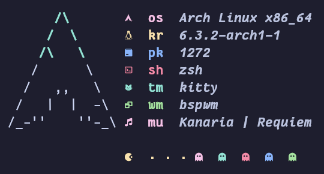

# sfetch

System fetch bash script for Arch Linux, ~~copied from~~ inspired by [rxfetch](https://github.com/Mangeshrex/rxfetch-) and [neofetch](https://github.com/dylanaraps/neofetch)

## Glyphs and Dependencies

- [Nerd Fonts](https://github.com/ryanoasis/nerd-fonts) (glyphs)
- [ttf-material-design-icons](https://aur.archlinux.org/packages/ttf-material-design-icons-git)AUR (glyphs)
- [playerctl](https://github.com/altdesktop/playerctl) (music player)
